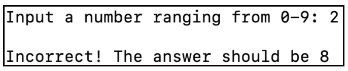
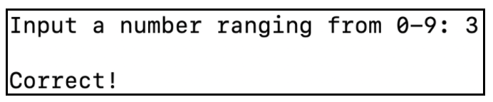

# Guessing a Random Number (Assembly Language)
This is a number guessing program written in Assembly Language for the x86_64 architecture.

## About
1. The program would first ask the user for an input which has to be a number between 0 and 9.  
    
2. The program would then use the system time to generate a pseudo random number.  
3. Finally, it would compare user's input with the generated random number, and print out the result message.
   * If the user guesses wrongly, the program would print a failure message, and the correct answer.  
        

   * If the user guesses correctly, the program would print the success message
           


## Implementation
This program could be executed in Linux using the net wide assembler (NASM).
```sh
nasm -felf64 index.asm && ld index.o && ./a.out
```